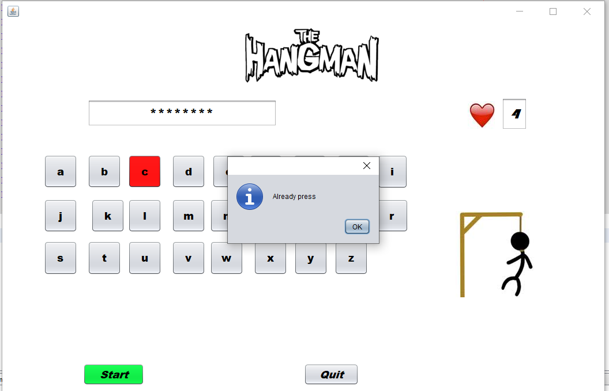

# Hangman Game
## What is it ?
Hangman is the game. In which player guess the character of hidden word.
<br>
Rules :
* In this game you will be given maximun 5 chances for guessing the correct word and if you do so within that then you will win.
* Do Not press the same key twice, if you do so then it give a warning.
* If your guess character is not present in the word then you loose one chance.
* If your guess is wrong then the character will become red.
*If your guess character is correct then the color will become green.


## How to setup this project locally
* Clone this repo in your machine
* Install JRE

    ```
    $ sudo apt install default-jre
    ```


* Install JDK 

    ```
   $ sudo apt install default-jdk
   ```


 * Use any code editor like eclipse, NetBeance for open this project
 * And Run 
     Frount.java ( that present in _Gui_ directory)
   </br> and enjoy the game 

## To Play Game

* Download jre file from given link <br>
https://drive.google.com/file/d/1PAj870BodIsL2-iTs91g6NOUBZlphXhq/view?usp=sharing

* for run this file java must present in your pc 

## Screenshots

 
<br>


<br>

<br>

<br>

<br>


